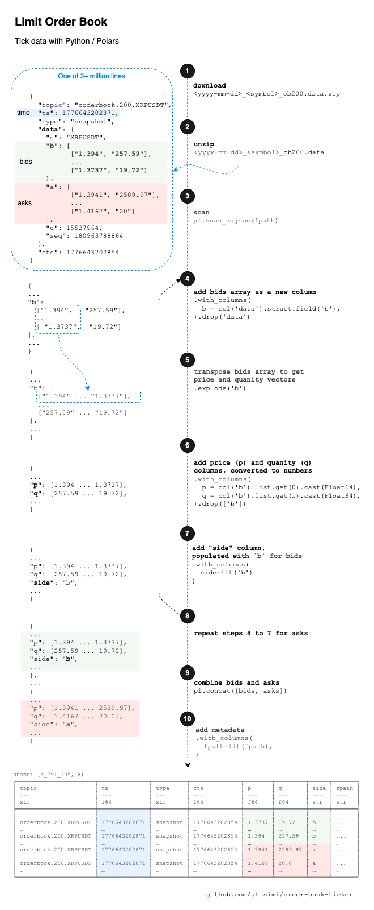
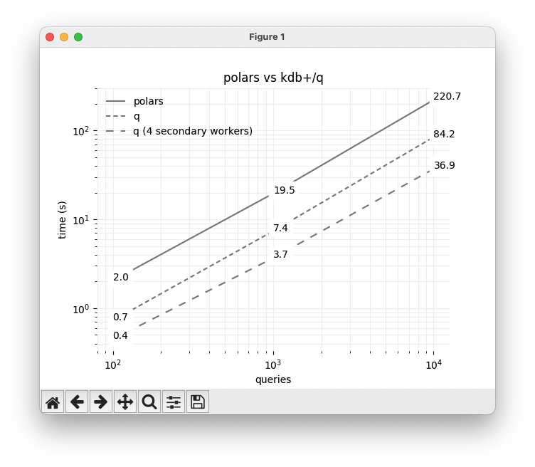

# Order Book Ticker

Limit Order Book (LOB) tick data processing.

## Motivations

* Signal generation from Limit Order Book (LOB)
* Backtesting of market making strategies
* Scalable techniques to handle large and complex datasets

## Progress

* 2026-04-20: `bfill.py` downloads and parses historical LOB files and makes them accessible as `parquet`
* 2026-04-25: benchmarked query performance using Python `polars` and `kdb+/q`

## Definitions

* `Bid`: The highest price a buyer is willing to pay
* `Ask`: The lowest price a seller is willing to accept
* `Market Order`: An order to buy or sell at the current market price
* `Limit Order`: An order to buy at or lower than a specific price, OR sell at or higher than a specific price
* `Limit Order Book (LOB)`: A queue system for `limit orders` where priority is based on price and then arrival time, or price-visibility-time if hidden orders is an option
* `BBO`: Best bid and offer (ask)
* `Polars`: An open-source library to work with large datasets ([Pola.rs](https://pola.rs)), also known as "fast pandas" due to the similarity of its API to the popular library `Pandas` library
* `kdb+/q`: A columnar time-series database with in-memory compute and streaming engines and an expressive language called `q`  ([kx.com](https://code.kx.com/q/))

## Overview of LOB Data

* Source of current LOB data is ByBit.com
* Historical data that the code downloads are accessible at https://www.bybit.com/derivatives/en/history-data
* LOB files are in zipped files, named as `<yyyy-mm-dd>_<symbol>_ob200.data.zip` where `ob200` stands for 200-level orderbook, i.e. max of 200 price-quantity for each bid/ask leg
* LOB files are `JSON Line (JSONL)`, where each line is a `JSON` object; for example:

```
{"topic": "orderbook.200.XRPUSDT", "ts": 1776701658172, "type": "snapshot", "data": {"s": "XRPUSDT", "b": [["1.4277", "12480.06"], ... ["1.4061", "979.58"]], "a": [["1.4278", "5226.89"], ... ["1.4487", "28.95"]], "u": 15908117, "seq": 181025905987}, "cts": 1776701658157}
```

* That line can be deserialized to a Python dictionary:

```py
{
 "topic": "orderbook.200.XRPUSDT",
 "ts": 1776701658172,
 "type": "snapshot",
 "data": {
   "s": "XRPUSDT",
   "b": [
     [
       "1.4277",
       "12480.06"
     ],
       # ... truncated ...
     [
       "1.4061",
       "979.58"
     ]
   ],
   "a": [
     [
       "1.4278",
       "5226.89"
     ],
       # ... truncated ...
     [
       "1.4487",
       "28.95"
     ]
   ],
   "u": 15908117,
   "seq": 181025905987
 },
 "cts": 1776701658157
}
```

* Key fields:
	* `ts`: timestamp of the message in milliseconds (ms)
	* `type`: there are two types:
		* `snapshot`:  complete states of LOB (i.e. all price levels up to the limit of the message's spec like 200 in this case)
		* `delta`: smaller messages to update quantity for an existing price level in LOB, or remove it, or add a new price level to the LOB
	* `data`: which includes symbol `s`, bids `b`, asks `a`, while each bid and ask data are n x 2 arrays of price (1st column) and quantity (2nd column)
	* `cts`: timestamp of creation of this orderbook by the matching engine which, according to ByBit, can be correlated with trade data (another stream)

* The challenge here is to efficiently parse and store massive volumes of such messages and make them ready for other applications like signal generation or backtesting

## Pipeline Architecture

## Ingestion

* `config.py`: Specifies symbols list and input/output directories, with the option to read from a `config.yml` file
* `bfill.py`: Downloads and parses LOB files and saves clean outputs as `parquet`
* The diagram shows LOB data structure and processing steps:



For example:

* Custom backfill, starting from 7 days ago for a 3-day period: `python bfill.py 7 3`
* Daily backfill, by scheduling `python bfill 1 1`

### Query

Tick data needs an optimized query engine. To get a sense of performance, I benchmarked `polars` and `kdb+/q` (community edition) where each query rebuilds the orderbook as of a certain timestamp, using `snapshot` and `delta` messages. `polars` directly uses the `parquet` files, while for `kdb+/q` I set up a standard `hdb` (Historical DB).



## Limitations

The focus is on research and development, not optimization. For example, to download files, there is a short pause between HTTP calls to access resources gently. 

## License
[CC BY 4.0](https://creativecommons.org/licenses/by/4.0/)

## Disclaimer

This is a personal research and, despite all attempts, there is no guarantee on the correctness or completeness of content. Use of or reference to any name, link, source, vendor, software, company, or instrument (e.g. coin), etc. is NOT endorsement or advice of any kind. Many of such choices are made either randomly or for convenience. For any copyrighted or licensed material or software, consult with the source, author, and terms of service(s). No part of this repo constitutes financial advice or consultancy of any kind, implicitly or explicitly. Seek independent advice before any decision.